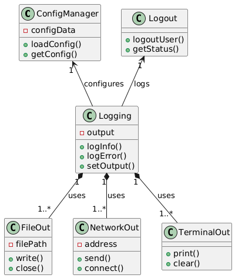

# CPP_Learning

for buiding all the directory Run below command from /workspaces/CPP_Learning/

**Build Command -**

sudo cmake -S . -B build

sudo cmake --build build

Data Router process has one factory design patter for choosing the output terminal based on config file input.

App is linking shared library **shared_memory_lib**
